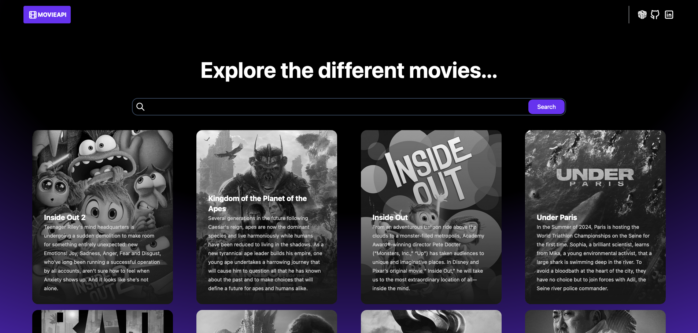
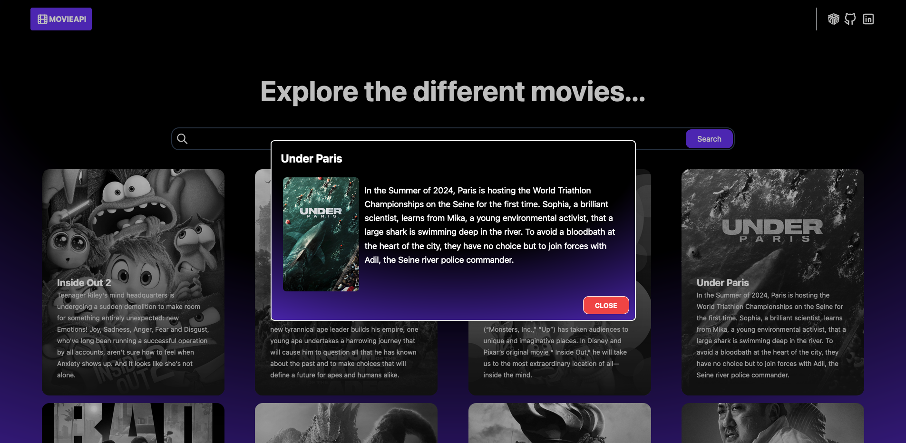

# MovieApi

MovieApi is an application that allows you to search for information about movies. When you load the app, a default list of movies is displayed. Users can search for movies by entering a name in the search field, and the app will display movies that match the search.

> Default Movie List: Displays a list of popular movies when you load the app.

> Movie Search: Allows you to search for movies by name.

> Friendly interface: Simple and easy-to-use design.

### Screenshot





### Links

Deploy by Vercel

- Site URL: [MovieApi](https://movie-api-delta-nine.vercel.app/)

## Installation

To run this project on your local machine, follow these steps:

1. Clone the repository:

```bash
https://github.com/norly96/Movie-Api.git
```

2. Navigate to the project directory:

```bash
cd MovieApi
```

3. Install the backend dependencies:

```bash
npm install
```

4. Set your environment variables. Create an .env file in the project root directory and add your TMDB API key:

```bash
VITE_TMDB_API_KEY=tu-api-key
VITE_TMDB_API_URL=https://api.themoviedb.org/3
VITE_TMDB_IMAGE_URL=https://image.tmdb.org/t/p/original
```

5. Start the server

```bash
npm run dev
```

## Used technologies

1. HTML, CSS, TypeScript, ReactJS, TailwindCSS

2. API: The Movie Database (TMDB) API

## Contact

    Name: Norluis Galvez Sanchez
    GitHub: https://github.com/norly96
    Linkedin: https://www.linkedin.com/in/norly96
